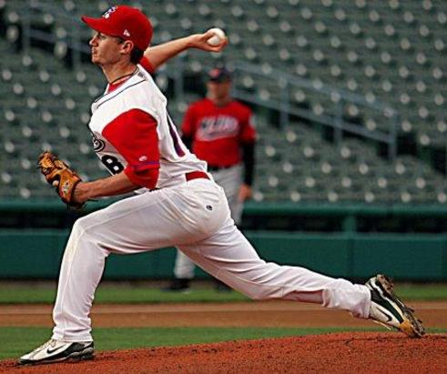

<!-- Main -->

<!-- One -->
<section id="one">
  

    <header class="major">
      <h2>Coaching Philosophy</h2>
    </header>
  

  The Crushers use a paid professional baseball coach for all team practices to teach consistent and correct baseball fundamentals. Practices focus on team baseball and develop advanced skills needed for Middle School and High School Baseball. The Professional Coach also works on an individual player development plan for every team member to help the player reach their goals. 
  

  Weekend Tournaments are managed by Parent Coaches who reinforce the team and individual techniques taught in practices. Attendance at all team practices is mandatory for our organization so expert team skills can be developed by all players.  
  

</section>

<!-- Two -->
<section id="two" class="spotlights">
  <section>
    
    

      

        <header class="major">
          <h3>Patrick Currin</h3>
        </header>
  

  Coach Patrick Currin is the Crushers Head Instructor for all our teams. Coach Patrick is a former Professional Baseball Player with 170 games played. A local Chapel Hill All State Player who earned Academic All-American honors with UNC Greensboro. Currently a Professional full time baseball coach at all levels for many local players and teams including the Orange County Crushers.  Coach Patrick teaches youth baseball throughout the year and can be reached at <a href="mailto:phcurrin5@yahoo.com">phcurrin5@yahoo.com</a>.
  

</section>
</section>

