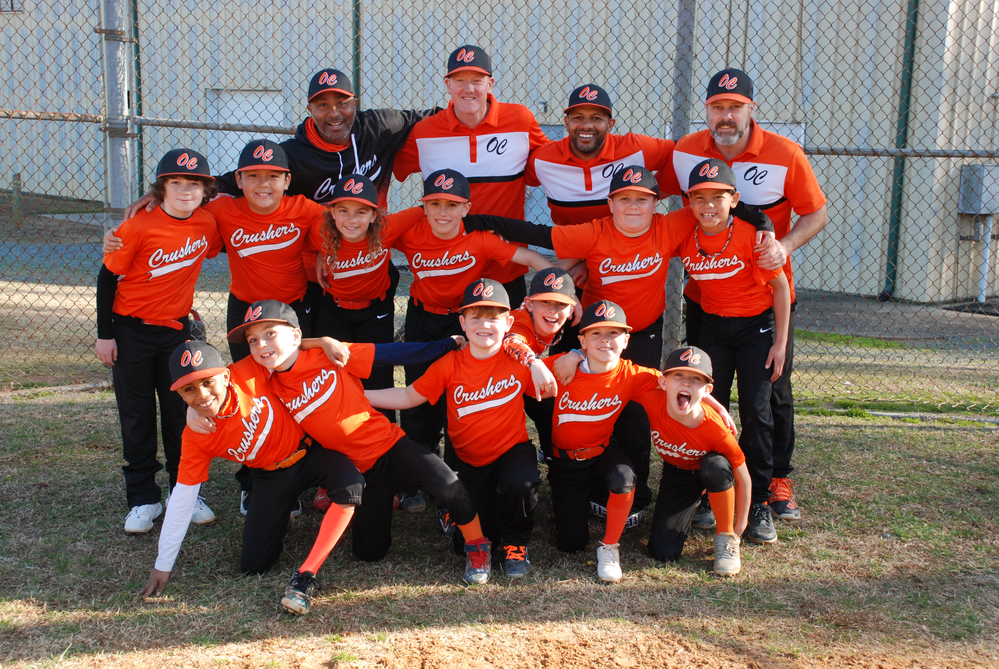
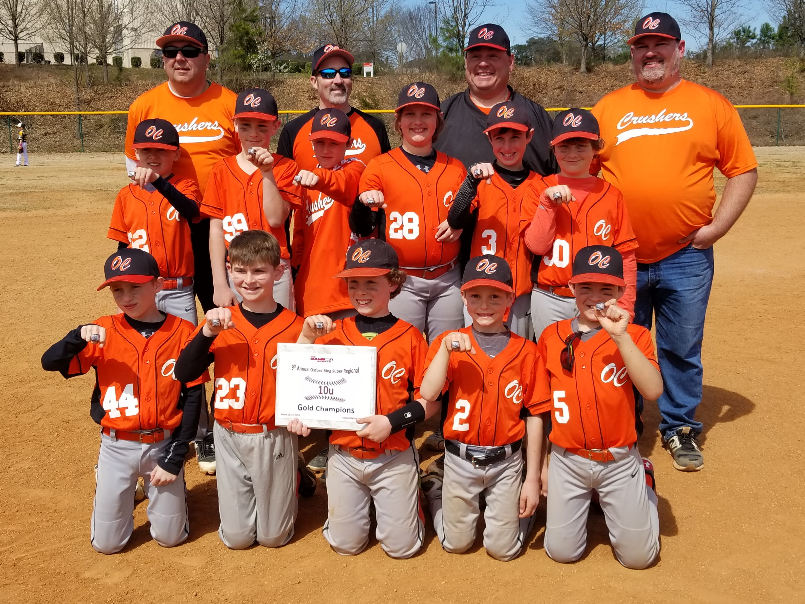
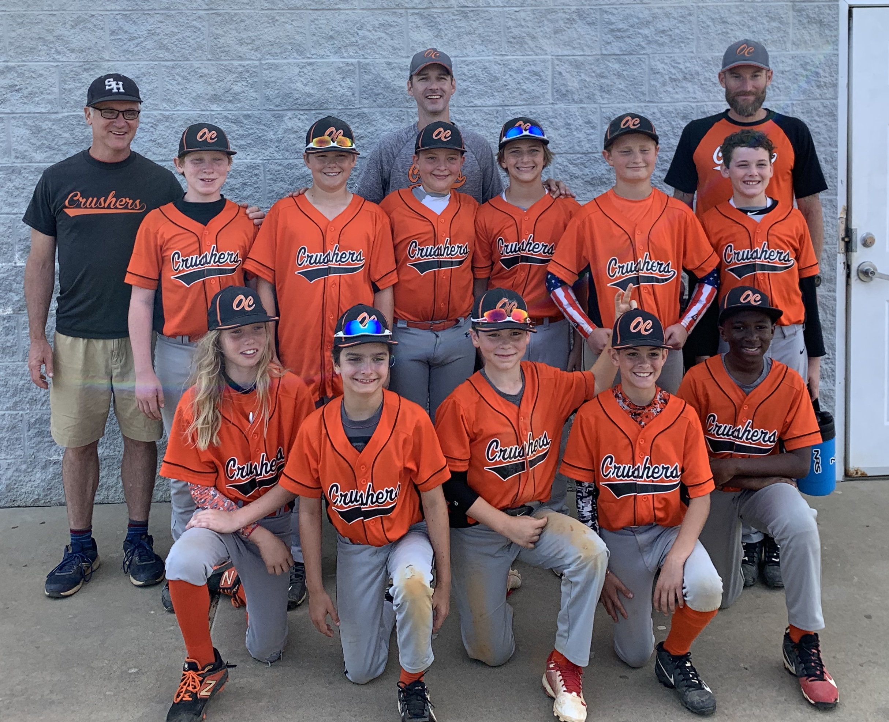
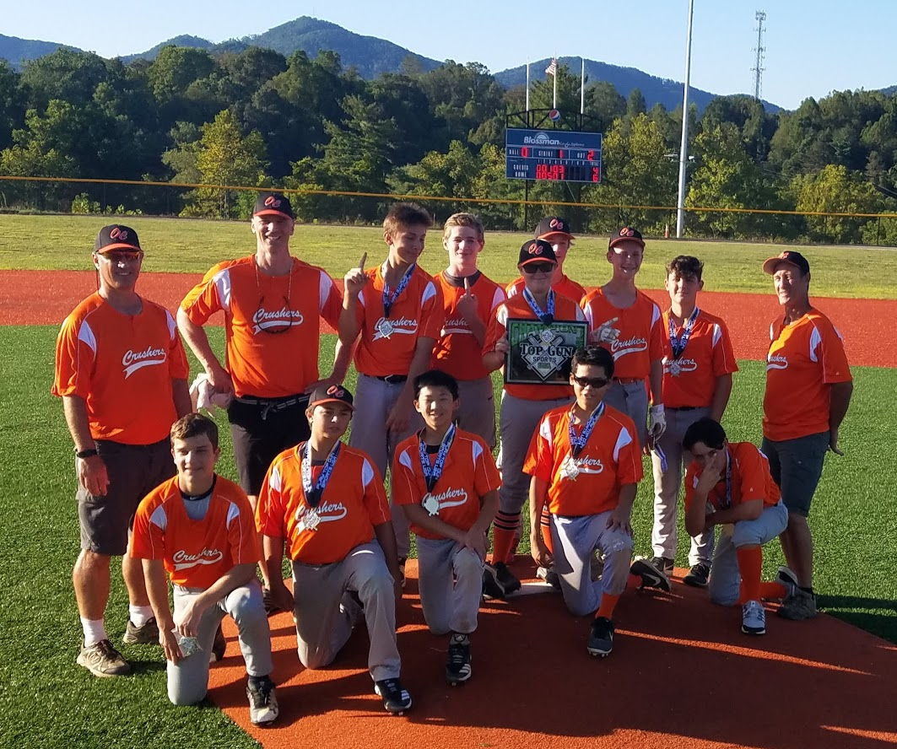
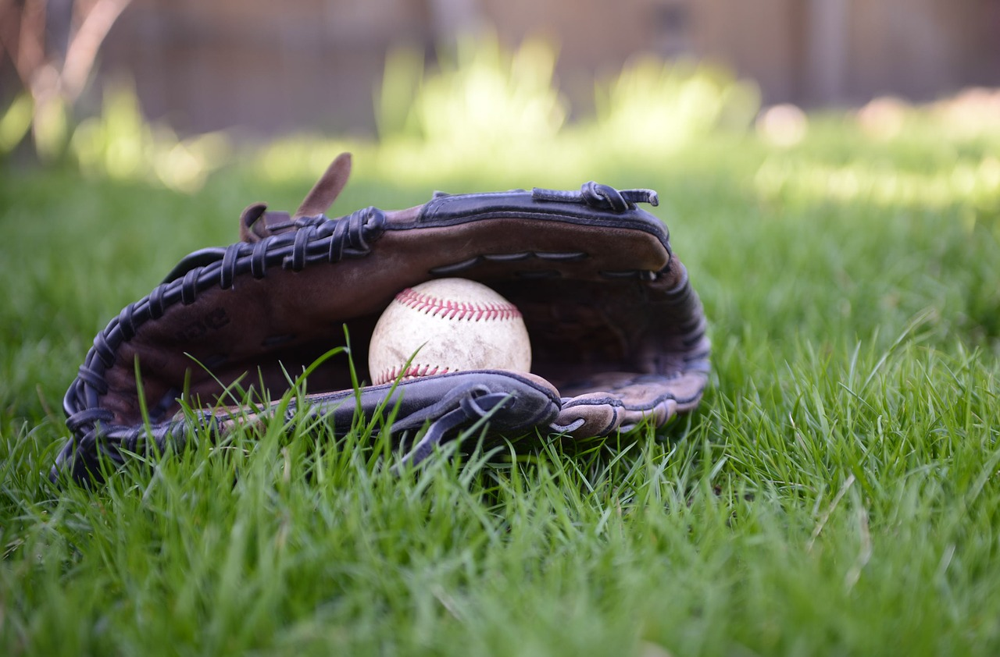

<!-- Main -->

<!-- Two -->
<section id="two" class="spotlights">
        <section>
                
                

                        

                                <header class="major">
                                        <h3>9U</h3>
                                </header>
                                
Head Coach: <a href="mailto:pjholmes99@gmail.com">Phil Holmes</a>

                                <!--
                                <ul class="actions">
                                        <li><a href="9u.html" class="button">Learn more</a></li>
                                </ul>
                                -->
                        

                

        </section>
	<section>
		
		

			

				<header class="major">
					<h3>10U</h3>
				</header>
				
Head Coach: <a href="mailto:phcurrin5@yahoo.com">Patrick Currin</a>

                                <!--
				<ul class="actions">
					<li><a href="10u.html" class="button">Learn more</a></li>
				</ul>
                                -->
			

		

	</section>
	<section>
		
		

			

				<header class="major">
					<h3>11U</h3>
				</header>
                                
Head Coach: If interested contact <a href="mailto:bstaats@gmail.com">Brad Staats</a>

                                <!-- FIXME
				<ul class="actions">
					<li><a href="11u.html" class="button">Learn more</a></li>
				</ul>
                                -->
			

		

	</section>
	<section>
		
		

			

				<header class="major">
					<h3>12U</h3>
				</header>
				
Head Coach: <a href="mailto:coynesmith@gmail.com">Tim Coynesmith</a>

                                <!-- FIXME
				<ul class="actions">
					<li><a href="12u.html" class="button">Learn more</a></li>
				</ul>
                                -->
			

		

	</section>
	<section>
		
		

			

				<header class="major">
					<h3>13U</h3>
				</header>
				
Head Coach: <a href="mailto:schuyler.jones@duke.edu">Schuyler Jones</a>

                                <!-- FIXME
				<ul class="actions">
					<li><a href="13u.html" class="button">Learn more</a></li>
				</ul>
                                -->
			

		

	</section>
	<section>
		
		

			

				<header class="major">
					<h3>14U</h3>
				</header>
				
Head Coach: <a href="mailto:sharward73@gmail.com">Shannon Harward</a>

                                <!-- FIXME
				<ul class="actions">
					<li><a href="14u.html" class="button">Learn more</a></li>
				</ul>
                                -->
			

		

	</section>
	<section>
		
		

			

				<header class="major">
					<h3>15U</h3>
				</header>
				
Head Coach: <a href="mailto:mpr1020@yahoo.com">Mike Roberts</a>

                                <!-- FIXME
				<ul class="actions">
					<li><a href="15u.html" class="button">Learn more</a></li>
				</ul>
                                -->
			

		

	</section>
	<section>
		
		

			

				<header class="major">
					<h3>16U</h3>
				</header>
				
Head Coach: <a href="mailto:jstillson10@gmail.com">John Stillson</a>

                                <!-- FIXME
				<ul class="actions">
					<li><a href="16u.html" class="button">Learn more</a></li>
				</ul>
                                -->
			

		

	</section>
	<section>
		
		

			

				<header class="major">
					<h3>17U</h3>
				</header>
				
Head Coach: <a href="mailto:jamesmparker93@gmail.com">Jay Parker</a>

                                <!-- FIXME
				<ul class="actions">
					<li><a href="17u.html" class="button">Learn more</a></li>
				</ul>
                                -->
			

		

	</section>
</section>

